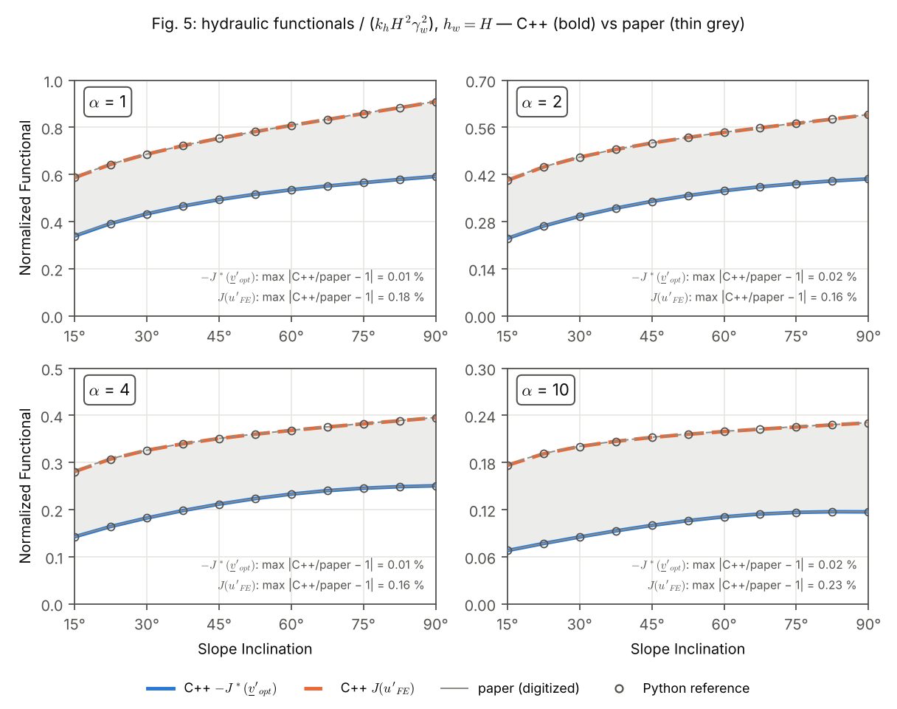
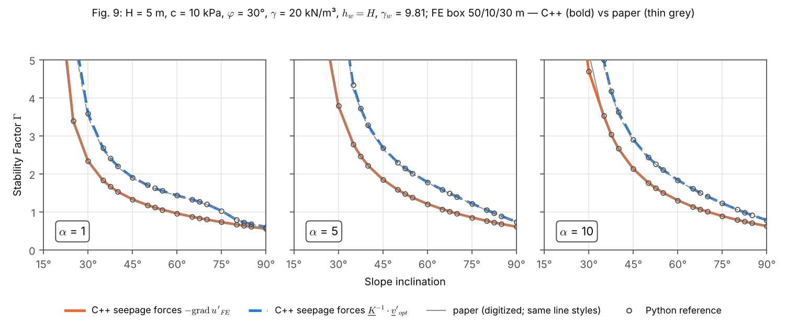
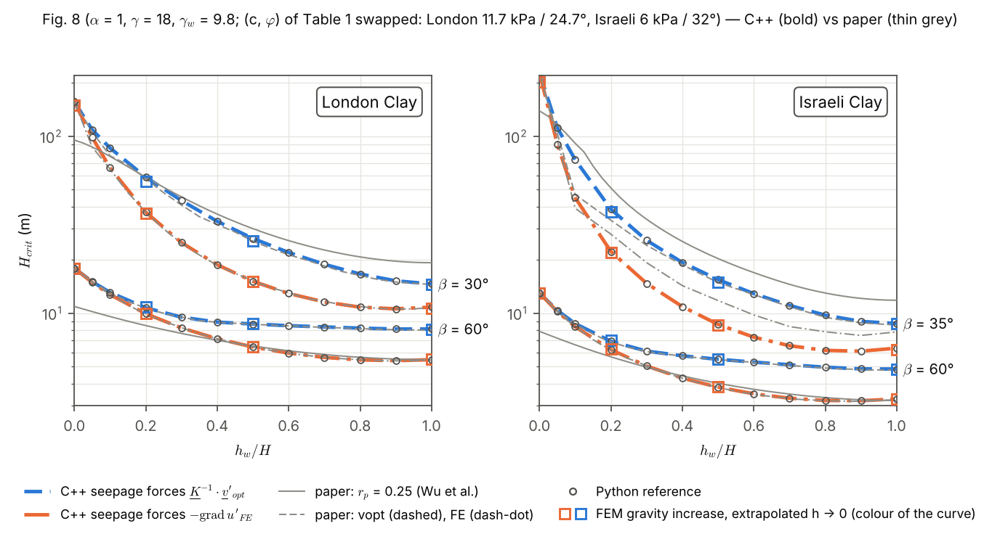

# SlopeSeepageForces

Estabilidade de taludes sob as forças de percolação de um rebaixamento rápido: reprodução dos resultados
determinísticos da Seção 4.3 de Ceron, Cecílio, Linn & Maghous, *Stability analysis of slope subjected to seepage
forces considering spatial variability of soil properties*, IJNAMG 49(11), 2025 (doi:10.1002/nag.3993).

## 1. Objetivo

Reproduzir com o NeoPZ as três figuras determinísticas da Seção 4.3 do artigo:

| figura | grandeza | dados |
|---|---|---|
| Fig. 5 | funcionais hidráulicos J(u'_FE) e −J*(v'_opt), divididos por k_h H² γw² | h_w = H, α = 1, 2, 4, 10, β = 15…90° |
| Fig. 8 | altura crítica H_crit × h_w/H | α = 1, γ = 18 kN/m³; painéis London (β = 30°, 60°) e Israeli (β = 35°, 60°) |
| Fig. 9 | fator de estabilidade Γ × β | H = 5 m, c = 10 kPa, φ = 30°, γ = 20 kN/m³, h_w = H, α = 1, 5, 10 |

Nas Figs. 8 e 9, Γ vem da análise limite cinemática (limite superior, Seção 4.2) com dois campos de forças de
percolação: −∇u'_FE (elementos finitos; curvas "FE") e K⁻¹·v'_opt (campo semi-analítico ótimo; curvas "vopt").
Como verificação independente, o fator de colapso dos mesmos casos é recalculado por elementos finitos
elastoplásticos (aumento de gravidade), com as forças de percolação como forças de volume, como em `SlopeDrawdown`.

Reaproveitado (sem alterar nenhum arquivo de `SlopeDrawdown`, `SlopeMohrCoulomb` ou da biblioteca):
`SlopeMohrCoulomb/SlopeAnalysis.h` (aumento de gravidade/SRM com refinamento da zona plástica) e `SlopeModel.h`
(Mohr–Coulomb, `TriGMesh`, contornos), incluídos como estão; `PoreField`, `SetSeepageForce` e `FactorOfSafety` de
`SlopeDrawdown/main.cpp`, generalizados em `SeepageForceField.h` e `FEMStability.h`. Implementações de referência em
Python (independentes do C++) em `scripts/`, dados digitalizados do artigo em `data/`, resultados em `results/`.

## 2. Modelo

**Convenções.** Coordenadas NeoPZ (y para cima): aresta do topo O = (0, 0), topo y = 0 para x ≤ 0, face de O ao pé
T = (H/tan β, −H), terreno do pé y = −H, nível d'água rebaixado no ponto W = (h_w/tan β, −h_w) da face. O artigo e
os scripts Python usam y para baixo (x_artigo = x, y_artigo = −y). Ids de contorno (os de `TriGMesh`): −1 base,
−2 lateral direita, −3 terreno do pé, −4 topo, −5 lateral esquerda, −6 face; solo 1. Unidades kN, m, kPa.

### 2.1 Problema hidráulico (Eqs. 20–21; `SeepageFE.h`, `AnisotropicDarcy.h`, `SlopeGeometry.h`, `DelaunayMesher.h`)

* Poropressão em excesso u = p − γw y_artigo (Eq. 2; p = poropressão total): −div(K ∇u) = 0, K = diag(k_h, k_v),
  α = k_h/k_v ≥ 1, H1 de ordem 2 (material próprio `TPZAnisotropicDarcy`: o `TPZDarcyFlow` é isotrópico).
* Dirichlet na superfície (Eq. 21), em coordenadas NeoPZ u = γw max(y, −h_w): u = 0 no topo, u = γw y na face acima
  d'água, u = −γw h_w abaixo dela e no terreno do pé.
* Domínio do artigo (Fig. 4): caixa **fixa em metros**, 50 m à esquerda de O, 10 m à direita de T e 30 m abaixo de T
  (`hboxm=50,10,30`), com **u = 0 na lateral esquerda e na base** e fluxo nulo à direita (`hbc=zero_lb`, padrão;
  evidências na seção 5). Malha de Delaunay (ângulo mínimo 28°) graduada para O, W, T e a face; produção `href=1`.
* Saídas: J(u) = ½∫∇u·K∇u, J/(k_h H² γw²) (Fig. 5) e f = −∇u (`SeepageForceField.h`: interpolante P2 por
  triângulo, quadtree, f = 0 fora da malha, seguro entre threads), pela interface `slope::ForceField` comum aos campos
  FE e analítico.

### 2.2 Campo analítico K⁻¹·v'_opt (Eqs. 29–40; `AnalyticalSeepage.h`)

Porte de `scripts/analytical_seepage.py` (dedução em `scripts/analytical_seepage_derivation.md`): velocidade ótima
da classe da Eq. 29 em torno de O, com zona 1 (r < R_w = h_w/sen β) pela Eq. 31 **corrigida** (seção 5), zona 2 até
R = H/sen β (Eq. 32) e zona 3 até R_e = √(H² + (L_m + H/tan β)²), L_m = 10 H (Eq. 33); f = K⁻¹·v'_opt, nulo fora do
solo, para r ≥ R_e e para h_w = 0; J* pela Eq. 40. O expoente m = √(C/D) minimiza Φ(m), com h2 (Eqs. 37–38) por
Dormand–Prince. Nos taludes íngremes o ótimo é o limite **degenerado m → 0** (zona 1 tangencial,
v = k_h γw sen β/A e_θ): β > 80,76° para α = 1, 81,10° para α = 2, 88,40° para α = 4, nenhum para α ≥ 5.

### 2.3 Análise limite cinemática (Seção 4.2, Eqs. 42–58; `LimitAnalysis.h`)

Porte de `scripts/limit_analysis.py`. Γ = min P_mr/(P_γ + P_u) (Eq. 55) sobre mecanismos rotacionais em espiral
logarítmica, I (B na face, η ∈ (0, 1]) e II (B no terreno do pé, d ≤ 10 H); H_crit = Γ(H)·H por semelhança. P_mr
pela Eq. 48; P_γ em forma fechada (f1 − f2 − f3, menos f4 em II) com γ' = γ − γw; P_u = ∫f·U pela fórmula de contorno
exata −∮u U·n ds para o campo FE (div U = 0) e por quadratura de Gauss polar, com quebras nos círculos R_w, R, R_e,
para o analítico. Otimização por classe e semente (0, 1, 2): PSO (40 partículas, ≤ 150 iterações) e Nelder–Mead
limitado (o do scipy), em threads, com resultado independente do número de threads. Diferenças deliberadas do
Python: números aleatórios de `std::mt19937_64` (os ótimos polidos coincidem) e `pools=25` (mais sorteios iniciais
quando quase nenhum mecanismo tem P_γ + P_u > 0; `pools=0` = Python). Γ = ∞ se nenhum mecanismo tem P_γ + P_u > 0.

### 2.4 Elementos finitos: aumento de gravidade com forças de percolação (`FEMStability.h`)

Aumento de gravidade de `SlopeAnalysis.h` (Mohr–Coulomb associado, P2, deformação plana, E = 20000 kPa, ν = 0,3) com
força de volume b = λ(γ' g + f), g = (0, −1), e contorno efetivo livre de tensões: λ multiplica γ' **e** f, logo
Γ_FEM = λ_crit e H_crit = λ_crit H. É a carga de `SlopeDrawdown`, b = λ(γ_sat g − ∇p) (`form=p`; `form=p+` com
p⁺ = max(p, 0) como lá; vetores de carga iguais a ≤ 3·10⁻¹⁷), e λ chega à função de forçamento como em
`SetSeepageForce` (λ = −m_force[1]/γ').

* Domínio de estabilidade sa H + H/tan β à esquerda de O, à direita de T e abaixo de T (`sa=2`), malha inicial com
  0,25 H em O, W, T e na face, crescendo até 1 H. `fembatch` o limita à caixa hidráulica (Fig. 9: lado direito a
  10 m = 2 H de T); `fs` recusa pontos de integração fora da caixa hidráulica (usar `sright=` etc.).
* Ciclos de refinamento da zona plástica como em `FactorOfSafety` (elementos com √J₂(εᵖ) ≥ `mark` × máximo no
  colapso divididos; `srm=1` calcula também o SRM). Cada ciclo divide h por 2 na zona plástica e λ decresce com
  ordem ≈ 1 em h: `ExtrapolateCycles` dá Γ_FEM = 2λ_n − λ_{n−1}, o Richardson de ordem observada e a reta em 1/√neq.

## 3. Compilar e executar

```
cmake -S <neopz> -B <build> -DBUILD_PLASTICITY_MATERIALS=ON -DBUILD_PROJECTS=ON   # uma vez
ninja -C <build> SlopeSeepageForces
<build>/Projects/SlopeSeepageForces/SlopeSeepageForces <comando> [chave=valor ...]
```

Fontes: `main.cpp` (documentação dos comandos e opções), `Commands.h`, `SeepageCommands.cpp` (`mesh`, `seepage`,
`probe`, `fig5`, `analytical`), `LimitAnalysisCommands.cpp` (`la`, `labatch`, `fig8`, `fig9`), `FEMCommands.cpp` (`fs`,
`fembatch`), `SelfTests.cpp` (`check`, `verify`), `FigureCases.h`, `ResumableCSV.h` e os cabeçalhos da seção 2.

| comando | o que faz |
|---|---|
| `mesh` | malhas hidráulica e de estabilidade, qualidade e consistência (`vtk=1` grava; `sweep=1`: β = 15…90°, h_w/H = 0…1) |
| `verify` | soluções manufaturadas do problema hidráulico (exatas em P2) e localização de pontos |
| `seepage` | J, J/(k_h H² γw²) e min p para `href=0,1,2` (ordem observada e Richardson); `csv=`, `vtk=` |
| `probe` | u e f nos pontos de `pts=<arquivo>` (linhas `x,y` em coordenadas do artigo) |
| `fig5` | funcionais da Fig. 5 contra o artigo (`alphas=`, `betas=`; `fe=0`: só o analítico); `out=<csv>`: grade de produção |
| `analytical` | campo K⁻¹·v'_opt: m, C, D, F, J* por zona; `pts=`, `csv=`, `bench=<n>`, `ref=<arquivo>` (comparação com o Python) |
| `la` | análise limite de um caso: Γ, H_crit, mecanismo (θ1, θ2, η ou d/H; A, B, C), P_mr, P_γ, P_u; `x=θ1,θ2,s` avalia um mecanismo |
| `labatch` | `la` para cada linha de `cases=<arquivo>`, uma linha por caso em `out=<csv>` (retomável) |
| `fig9` | Fig. 9 por análise limite → `results/cpp/fig9.csv` (retomável, progresso em `fig9.log`) |
| `fig8` | Fig. 8 por análise limite → `results/cpp/fig8.csv` (`soil=table1`: Tabela 1 como impressa → `fig8_table1.csv`) |
| `fs` | fator de aumento de gravidade com o campo FE (`water=fe`), analítico (`water=analytical`), sem percolação (`none`) ou seco (`dry`) |
| `fembatch` | MEF dos casos da Fig. 9 (`fig=9`) ou da Fig. 8 (`fig=8`), com a análise limite do mesmo caso na linha → `results/cpp/fem_fig9.csv`, `fem_fig8.csv` (retomável) |
| `check` | autotestes (153 verificações, ~30 s; código de saída 1 se algum falhar; seção 6) |

Opções principais (padrão; lista completa no cabeçalho de `main.cpp`): `H=5 beta=45 hw=1` (h_w/H) `gamma=20
gammaw=9.81 c=10 phi=30 E=20000 nu=0.3 alpha=1`; `hbc=zero_lb` (`impermeable`, `zero_b`, `zero_l`, `zero_lbr`,
`toe_r`) `horder=2 href=0`, caixa `hleft=50 hright=10 hdepth=30` (em H) ou `hboxm=50,10,30` (em m); `sa=2 sh0=0.25
shs=0.25 sgrade=0.25 shmax=1`; `fs`: `nref=3 mark=0.1 maxnewton=100 tolfs=0.002 form=u`; `la`: `mech=I,II
seeds=0,1,2 np=40 niter=150 pools=25 qsearch=coarse qfinal=fine threads=4`. `fig8`/`fig9`/`fembatch` usam por padrão
os dados do artigo, `hboxm=50,10,30` e `href=1` (e recusam `hleft`/`hright`/`hdepth`); `fig8`: `soil=swapped
gammaw=9.8 H=1`; `fig9`: `H=5 gammaw=9.81`; `fembatch`: `nref=3 mark=0.05 sa=2`. Opções desconhecidas ou valores
inválidos são erro. Os CSVs de produção guardam por linha uma cadeia `settings`: um caso já presente com as mesmas
configurações é pulado e uma linha cortada por uma interrupção é refeita.

Exemplos (a partir deste diretório; B = o executável):

```
$B check
$B seepage beta=45 alpha=5 href=0,1,2
$B fig5 alphas=1,4 betas=30,60,90 href=1
$B analytical ref=data/analytical_seepage_reference.csv
$B la H=5 beta=60 hw=1 water=fe hboxm=50,10,30 href=1            # Fig. 9, α = 1, β = 60°: Γ = 0,9571
$B la H=5 beta=60 hw=1 water=analytical                          # idem, K⁻¹·v'_opt: Γ = 1,4289
$B la H=1 beta=90 c=1 phi=0 gamma=1 water=dry                    # corte vertical seco: N = 3,8313
$B fs H=5 beta=60 hboxm=50,10,30 href=1 sright=2 nref=3 mark=0.05   # MEF do mesmo caso (ciclo 0: λ = 1,1958)
# regressão contra SlopeDrawdown (seção 6): seco e percolação permanente na malha de SlopeMohrCoulomb
$B fs H=10 beta=45 gammaw=10 water=dry smesh=trig srm=1 nref=3 maxnewton=30
$B fs H=10 beta=45 gammaw=10 hbc=impermeable hmesh=trig horder=1 form=p+ smesh=trig srm=1 nref=3 maxnewton=30
$B fig9 alphas=5 betas=60 curves=FE out=teste.csv
```

Scripts de produção e de pós-processamento (retomáveis; tempos em `results/cpp/runtimes.txt`, `fem_runtimes.txt`):

```
sh scripts/run_cpp_figures.sh [$B] [threads]      # fig5 out=, fig9, fig8, fig8 soil=table1, variantes de γw, plot
python3 scripts/plot_results.py                   # results/fig{5,8,9}.png, fig8_table1.png, results/cpp/comparison_*
CPUS=2,3 sh scripts/run_fem_convergence.sh        # estudo de convergência do MEF -> results/fem/convergence/*.log
python3 scripts/fem_convergence_table.py          # -> results/fem/convergence/summary.txt, summary.csv
CPUS=0,1 sh scripts/run_fem_batch.sh "" 9         # lote MEF da Fig. 9 -> results/cpp/fem_fig9.csv
CPUS=2,3 sh scripts/run_fem_batch.sh "" 8         # lote MEF da Fig. 8 -> results/cpp/fem_fig8.csv
python3 scripts/fem_batch_table.py                # MEF x análise limite x artigo -> results/cpp/comparison_fem_fig*.csv
```

`plot_results.py` lê só CSVs versionados (`results/cpp/fig*.csv`, `fem_fig{8,9}.csv` e `python_fig9_FE_box_m.csv`,
`results/reproduce_python/comparison_*.csv`, `data/paper_fig*_vertices.csv`) e regenera as figuras e as comparações
bit a bit iguais às versionadas (3 s). Tempos de `run_cpp_figures.sh` (2 threads): `fig5 out=` 116 s, `fig9` 268 s
(120 casos), `fig8` 405 s (92), `fig8 soil=table1` 380 s.

## 4. Resultados

Produção: caixa hidráulica 50/10/30 m, `zero_lb`, `href=1`; L_m = 10 H; mecanismos I e II, sementes 0, 1, 2. Fig. 9
em H = 5 m (caixa = 10/2/6 H), γw = 9,81; Fig. 8 em H = 1 m (caixa = 50/10/30 H), γw = 9,8 e pares (c, φ) da
Tabela 1 trocados (London c = 11,7 kPa, φ = 24,7°; Israeli c = 6 kPa, φ = 32°; seção 5). Comparação nos vértices
digitalizados do artigo (`data/paper_fig*_vertices.csv`; Fig. 8 interpolada em escala log); "visíveis" exclui as
pontas cortadas do artigo, extrapoladas (*). Dados completos em `results/cpp/comparison_fig{5,8,9}.csv` e
`comparison_summary.txt`. Nas figuras: artigo em cinza fino, C++ em traço grosso, Python em círculos vazados e o
MEF da seção 4.4 em quadrados vazados da cor da curva.

### 4.1 Fig. 5 — funcionais hidráulicos (`results/fig5.png`)



β = 15…90° de 7,5 em 7,5° (11 ângulos), h_w = H. C++/artigo − 1:

| α | −J*(v'_opt): faixa | média | J(u'_FE): faixa | média | β = 90°: J(u'_FE) C++ / artigo | −J*(v'_opt) C++ / artigo |
|---|---|---|---|---|---|---|
| 1 | −0,009 … +0,009 % | −0,002 % | −0,178 … −0,014 % | −0,066 % | 0,90875 / 0,91037 | 0,59138 / 0,59140 |
| 2 | −0,020 … +0,003 % | −0,005 % | −0,159 … −0,014 % | −0,063 % | 0,59725 / 0,59820 | 0,40656 / 0,40658 |
| 4 | −0,014 … +0,005 % | −0,007 % | −0,157 … −0,028 % | −0,072 % | 0,39503 / 0,39565 | 0,25046 / 0,25045 |
| 10 | −0,021 … +0,002 % | −0,006 % | −0,225 … −0,046 % | −0,107 % | 0,23039 / 0,23091 | 0,11705 / 0,11705 |

J(u'_FE) fica sempre um pouco abaixo do artigo: J converge por cima com o refinamento (β = 45°, α = 1:
0,7531852 / 0,7531750 / 0,7531721 com `href=0/1/2`, ordem 1,81), e a malha do artigo (Fig. 4a) é mais grossa. O
ótimo degenerado (m = 0) aparece em β = 82,5° e 90° para α = 1 e 2 e em 90° para α = 4, como no artigo.
C++ × Python: −J* ≤ 3,5·10⁻⁶ (as 6 casas do CSV Python), J ≤ 6,0·10⁻⁵ (malhas diferentes).

### 4.2 Fig. 9 — Γ × β (`results/fig9.png`)



Γ C++ / artigo e C++/artigo − 1 nos pontos visíveis (n; Γ ≤ 5):

| α | curva | β = 30° | 45° | 60° | 75° | 90° | n | média | máx. \|·\| (β) |
|---|---|---|---|---|---|---|---|---|---|
| 1 | FE | 2,333 / 2,322 | 1,326 / 1,312 | 0,9571 / 0,9557 | 0,7281 / 0,7202 | 0,5513 / 0,5548 | 18 | +0,65 % | 1,13 % (35°) |
| 1 | vopt | 3,579 / 3,490 | 1,904 / 1,888 | 1,429 / 1,423 | 1,025 / 1,023 | 0,6014 / 0,6046 | 17 | +0,65 % | 2,56 % (30°) |
| 5 | FE | 3,786 / 3,757 | 1,847 / 1,837 | 1,207 / 1,198 | 0,8508 / 0,8429 | 0,6080 / 0,6088 | 17 | +0,40 % | 1,15 % (35°) |
| 5 | vopt | 6,848 / 6,871* | 2,683 / 2,655 | 1,780 / 1,767 | 1,216 / 1,207 | 0,7357 / 0,7348 | 16 | +0,73 % | 3,39 % (35°) |
| 10 | FE | 4,694 / 5,176* | 2,130 / 2,101 | 1,300 / 1,288 | 0,8876 / 0,8790 | 0,6235 / 0,6240 | 16 | +0,51 % | 1,66 % (35°) |
| 10 | vopt | 8,807 / — | 2,897 / 2,866 | 1,833 / 1,823 | 1,223 / 1,214 | 0,7803 / 0,7778 | 16 | +0,69 % | 3,10 % (35°) |

As duas curvas ficam em média 0,4–0,7 % acima do artigo; os maiores desvios (vopt, 2,6–3,4 %) estão em
β = 30–35°, onde a curva sobe rápido (sobre esse viés, ver a seção 5). Γ = ∞ (nenhum mecanismo com P_γ + P_u > 0)
em β = 15° no campo FE e em β = 15–20° no vopt com α = 5 e 10. Mecanismos: de pé (I com η = 1) em quase todos os
casos; de face no vopt com α = 1 em β = 15° e 20° (η = 0,13 e 0,76); tipo II no FE com α = 5 em β = 20–25° e α = 10
em β = 20–30° (A em O: L/H ≤ 0,013). C++ × Python (mesma classe de mecanismo em todos os casos): vopt ≤ 4,7·10⁻⁶;
FE ≤ 2,1·10⁻⁴ (malhas hidráulicas diferentes), exceto β = 20° fora da escala (α = 5: 4,4·10⁻⁴; α = 10: Γ = 37,94 ×
38,22, 7,2·10⁻³, ótimo na fronteira L → 0 da classe, 1 % de dispersão entre sementes).

### 4.3 Fig. 8 — H_crit × h_w/H (`results/fig8.png`)



H_crit (m) C++ / artigo e C++/artigo − 1 nos pontos visíveis (n, incluindo h_w = 0 quando visível):

| painel | curva | h_w/H = 0,1 | 0,2 | 0,5 | 1 | n | média | máx. \|·\| (h_w/H) |
|---|---|---|---|---|---|---|---|---|
| London 30° | vopt | 85,74 / 77,48 | 58,70 / 57,43 | 26,41 / 25,51 | 14,61 / 14,52 | 12 | +3,2 % | 10,7 % (0,1) |
| London 30° | FE | 66,27 / 65,16 | 37,21 / 37,24 | 15,13 / 15,20 | 10,81 / 10,77 | 12 | +1,2 % | 13,4 % (0,05) |
| London 60° | vopt | 13,09 / 13,07 | 10,72 / 10,68 | 8,674 / 8,625 | 8,127 / 8,045 | 12 | +0,4 % | 1,0 % (1) |
| London 60° | FE | 12,72 / 12,76 | 9,921 / 9,909 | 6,434 / 6,434 | 5,454 / 5,412 | 12 | −0,02 % | 0,8 % (1) |
| Israeli 35° | vopt | 73,65 / 46,80 | 38,66 / 33,49 | 15,46 / 14,88 | 8,728 / 8,563 | 10 | +9,6 % | 57,4 % (0,1) |
| Israeli 35° | FE | 44,91 / 39,16 | 22,30 / 27,94 | 8,630 / 11,78 | 6,336 / 7,827 | 10 | −18,6 % | 26,7 % (0,5) |
| Israeli 60° | vopt | 8,722 / 8,686 | 6,925 / 6,905 | 5,482 / 5,438 | 4,828 / 4,788 | 12 | +0,6 % | 1,1 % (0,8) |
| Israeli 60° | FE | 8,372 / 8,394 | 6,214 / 6,197 | 3,811 / 3,805 | 3,271 / 3,235 | 12 | +0,2 % | 1,1 % (1) |

Os painéis de 60° (as duas curvas) ficam a ≤ 1,1 % do artigo em todo h_w, e London 30° FE a ≤ 1,7 % fora de
h_w/H = 0,05. Discrepâncias (seção 5, itens 5 e 6): Israeli 35° FE 18,5–26,7 % abaixo do artigo para h_w/H ≥ 0,2;
vopt de London 30° e Israeli 35° acima em h_w pequeno (+10,7 % e +57,4 % em 0,1); London 30° FE +13,4 % em 0,05.
Mecanismos de face (η < 1) no vopt de London 30° (h_w/H = 0,4–0,7) e de Israeli 35° (0,2–0,7) e no FE de Israeli 35°
(0,05–0,3); de pé nos demais. C++ × Python ≤ 4,6·10⁻⁵ nos 92 casos, mesmos mecanismos (≤ 1,2·10⁻⁴ com a Tabela 1
como impressa).

### 4.4 Verificação FEM (abordagem do `SlopeDrawdown`)

O aumento de gravidade (seção 2.4) com o mesmo campo da análise limite verifica as Figs. 8 e 9 sem restringir a
forma do mecanismo. A análise limite é um limite superior do fator de colapso λ* do mesmo problema (material
associado, mesmas forças), Γ_LA ≥ λ*, e o MEF em deslocamentos converge para λ* por cima (malhas grossas não
representam a banda de cisalhamento): λ_FEM(h) ↓ λ* ≤ Γ_LA, e o valor extrapolado para h → 0 não deve passar de Γ_LA.

**Estudo de convergência** (`scripts/run_fem_convergence.sh`; `results/fem/convergence/*.log`, `summary.txt`,
`summary.csv`): dados da Fig. 9 (H = 5 m, h_w = H, α = 1), caixa 50/10/30 m, `href=1`, `sa=2` com o lado direito a
2 H de T, `maxnewton=100`, `tolfs=0.002`, marcação de 5 % (a de produção). λ por ciclo (equações) e extrapolados
(entre parênteses: relativos a Γ_LA):

| β, campo | ciclo 0 | 1 | 2 | 3 | 4 | 2λ₃ − λ₂ | 2λ₄ − λ₃ | Γ_LA | artigo |
|---|---|---|---|---|---|---|---|---|---|
| 30°, FE | 3,1199 (1240) | 2,6475 (2128) | 2,4453 (4050) | 2,3574 (8770) | 2,3223 (20988) | 2,2695 (−2,7 %) | 2,2871 (−2,0 %) | 2,3328 | 2,3216 |
| 60°, FE | 1,1958 (826) | 1,0881 (1162) | 1,0273 (2014) | 0,9922 (3924) | 0,9746 (8384) | 0,9570 (−0,00 %) | 0,9570 (−0,00 %) | 0,9571 | 0,9557 |
| 90°, FE | 0,7432 (682) | 0,6487 (946) | 0,5991 (1568) | 0,5762 (3168) | 0,5625 (6292) | 0,5532 (+0,4 %) | 0,5488 (−0,4 %) | 0,5513 | 0,5548 |
| 60°, vopt | 1,8125 (826) | 1,6235 (1056) | 1,5313 (1754) | 1,4785 (3420) | 1,4551 (7266) | 1,4258 (−0,2 %) | 1,4316 (+0,2 %) | 1,4289 | 1,4228 |

* λ decresce em todos os ciclos (diferenças sucessivas na razão ≈ 0,4–0,6, ordem ≈ 1). No ciclo 4 ainda está
  1,8–2,0 % acima de Γ_LA em β = 60°, 90° e no vopt, e 0,5 % abaixo em β = 30°. Extrapolados: 2λ₄ − λ₃ de −2,0 % a
  +0,2 % de Γ_LA, Richardson de ordem observada (ciclos 2–4) de −1,6 % a +0,5 %; em β = 60° o ciclo 5 (0,96484,
  17 228 equações, 23 min) dá 2λ₅ − λ₄ = 0,9551 (−0,2 %).
* Marcação de 2 % (`*_m02.log`): mesmos λ a ≤ 0,6 %, com 25–37 % mais equações no ciclo 4; 10 %: 0,6–1,1 % acima
  (β = 60°). Malha inicial de 0,125 H: o ciclo k ≈ o ciclo k + 1 da de 0,25 H. Refinamento uniforme `sref=1`/`sref=2`
  dá os λ dos ciclos adaptativos 1 e 2 com 2,5 a 5,4 vezes mais equações.
* Driver (β = 60°, ciclos 0–2): `maxnewton=200` = 100; `maxnewton=30` (o de `SlopeMohrCoulomb`/`SlopeDrawdown`)
  −0,4/−0,8/−0,9 % (tentativas que convergiriam são declaradas falhas); `tolfs` 0,001 ou 0,005: ≤ 0,4 %. Domínio
  (ciclo 2, 2 %; `sa=1.5`/2/3, lado direito a 1,5 H): β = 30° 2,393/2,445/2,419/2,401, β = 90°
  0,5879/0,5982/0,5996/0,5982, ±1–2 % sem tendência: ruído da malha inicial, não efeito da caixa.
* Produção (padrões de `fembatch`): `nref=3`, `mark=0.05`, `sa=2`, Γ_FEM = 2λ₃ − λ₂ (ciclos 0–3: ~13 min em
  β = 30°, ~3 min em β = 60–90°, 2 CPUs). Difere de 2λ₄ − λ₃ em −0,8 % (β = 30°), 0,0 % (60°), +0,8 % (90°) e
  −0,4 % (vopt), e em β = 30° fica 2,7 % abaixo de Γ_LA (sequência pré-assintótica); λ₃ fica 3,7–4,2 % acima de Γ_FEM.
  Na Fig. 8 o MEF roda em H_ref = H_crit da análise limite (3 algarismos; caixa 50/10/30 H_ref), para que λ ≈ 1, e
  H_crit = Γ_FEM·H_ref (semelhança: vetores de carga em H e 4 H iguais a 6·10⁻¹⁴ em `check`).

**Lote de produção** (`scripts/run_fem_batch.sh`, concluído; 2 CPUs por figura, Fig. 9 em 2,8 h e Fig. 8 em 2,7 h de
parede, pilotos incluídos, `results/cpp/fem_runtimes.txt`): Fig. 9, α = 1, 5, 10 × β = 30…90° de 15 em 15° × FE, vopt
(30 casos; 3058–10 866 equações no ciclo 3; 3–13 min por caso); Fig. 8, 4 painéis × h_w/H = 0; 0,2; 0,5; 1 × FE, vopt
(28 rodadas: em h_w = 0 as duas curvas são a mesma rodada sem percolação; 2850–9186 equações; 2–13 min). Cada linha de
`results/cpp/fem_fig9.csv` / `fem_fig8.csv` guarda λ e equações de todos os ciclos, os três extrapolados (ordem 1,
Richardson de ordem observada, reta em 1/√neq), a zona plástica de 1 %, Γ_LA do caso com o mesmo campo, os tempos e
as configurações; `python3 scripts/fem_batch_table.py` imprime as tabelas completas e escreve
`results/cpp/comparison_fem_fig9.csv` / `comparison_fem_fig8.csv` (artigo interpolado em escala log na Fig. 8). Resumo
abaixo: Γ_FEM = 2λ₃ − λ₂ (h → 0) / Γ_LA / artigo e, por curva, média e máximo em módulo de Γ_FEM/Γ_LA − 1 e de
Γ_FEM/artigo − 1 (com o β ou h_w/H onde ocorre); "—": fora da escala do artigo (Fig. 9, Γ > 5; valores extrapolados
na seção 4.2) ou ponta cortada (Israeli 35°, h_w = 0: 229,3 m extrapolado, seção 5, item 3). Nas figuras os valores
MEF são os quadrados vazados.

Fig. 9 (`results/fig9.png`), Γ_FEM / Γ_LA / artigo:

| α | curva | β = 30° | 45° | 60° | 75° | 90° | MEF/LA − 1: média | máx. (β) | MEF/artigo − 1: média | máx. (β) |
|---|---|---|---|---|---|---|---|---|---|---|
| 1 | FE | 2,270 / 2,333 / 2,322 | 1,320 / 1,326 / 1,312 | 0,9570 / 0,9571 / 0,9557 | 0,7271 / 0,7281 / 0,7202 | 0,5532 / 0,5513 / 0,5548 | −0,59 % | −2,71 % (30°) | −0,17 % | −2,24 % (30°) |
| 1 | vopt | 3,548 / 3,579 / 3,490 | 1,899 / 1,904 / 1,887 | 1,426 / 1,429 / 1,423 | 1,027 / 1,025 / 1,023 | 0,6062 / 0,6014 / 0,6046 | −0,07 % | −0,85 % (30°) | +0,63 % | +1,69 % (30°) |
| 5 | FE | 3,148 / 3,786 / 3,756 | 1,807 / 1,847 / 1,837 | 1,206 / 1,207 / 1,198 | 0,8545 / 0,8508 / 0,8429 | 0,6077 / 0,6080 / 0,6088 | −3,74 % | −16,84 % (30°) | −3,19 % | −16,19 % (30°) |
| 5 | vopt | 6,548 / 6,848 / — | 2,674 / 2,683 / 2,655 | 1,789 / 1,780 / 1,766 | 1,224 / 1,216 / 1,207 | 0,7373 / 0,7357 / 0,7348 | −0,68 % | −4,39 % (30°) | +0,93 % | +1,38 % (75°) |
| 10 | FE | 3,535 / 4,694 / — | 2,035 / 2,130 / 2,101 | 1,297 / 1,300 / 1,288 | 0,8867 / 0,8876 / 0,8790 | 0,6274 / 0,6235 / 0,6240 | −5,77 % | −24,69 % (30°) | −0,26 % | −3,15 % (45°) |
| 10 | vopt | 8,224 / 8,807 / — | 2,894 / 2,897 / 2,866 | 1,836 / 1,833 / 1,823 | 1,224 / 1,223 / 1,214 | 0,7783 / 0,7803 / 0,7778 | −1,36 % | −6,62 % (30°) | +0,64 % | +0,96 % (45°) |

Fig. 8 (`results/fig8.png`), H_crit (m) MEF / LA / artigo:

| painel | curva | h_w/H = 0 | 0,2 | 0,5 | 1 | MEF/LA − 1: média | máx. (h_w/H) | MEF/artigo − 1: média | máx. (h_w/H) |
|---|---|---|---|---|---|---|---|---|---|
| London 30° | vopt | 150,3 / 156,5 / 156,6 | 55,55 / 58,70 / 57,43 | 25,57 / 26,41 / 25,51 | 14,59 / 14,61 / 14,52 | −3,16 % | −5,37 % (0,2) | −1,63 % | −4,02 % (0) |
| London 30° | FE | 150,3 / 156,5 / 156,6 | 36,47 / 37,21 / 37,24 | 15,15 / 15,13 / 15,20 | 10,64 / 10,81 / 10,77 | −1,86 % | −4,01 % (0) | −1,91 % | −4,03 % (0) |
| London 60° | vopt | 17,90 / 17,95 / 17,95 | 10,81 / 10,72 / 10,68 | 8,698 / 8,674 / 8,625 | 8,114 / 8,127 / 8,045 | +0,19 % | +0,88 % (0,2) | +0,67 % | +1,21 % (0,2) |
| London 60° | FE | 17,90 / 17,95 / 17,95 | 9,959 / 9,921 / 9,909 | 6,436 / 6,434 / 6,434 | 5,479 / 5,454 / 5,412 | +0,16 % | +0,46 % (1) | +0,38 % | +1,24 % (1) |
| Israeli 35° | vopt | 203,1 / 228,8 / — | 37,49 / 38,66 / 33,49 | 14,97 / 15,46 / 14,88 | 8,739 / 8,728 / 8,563 | −4,34 % | −11,26 % (0) | +4,87 % | +11,94 % (0,2) |
| Israeli 35° | FE | 203,1 / 228,8 / — | 22,06 / 22,30 / 27,94 | 8,588 / 8,630 / 11,78 | 6,235 / 6,336 / 7,827 | −3,60 % | −11,26 % (0) | −22,82 % | −27,07 % (0,5) |
| Israeli 60° | vopt | 12,92 / 12,99 / 12,99 | 6,998 / 6,925 / 6,905 | 5,501 / 5,482 / 5,438 | 4,830 / 4,828 / 4,788 | +0,24 % | +1,04 % (0,2) | +0,73 % | +1,34 % (0,2) |
| Israeli 60° | FE | 12,92 / 12,99 / 12,99 | 6,252 / 6,214 / 6,197 | 3,819 / 3,811 / 3,805 | 3,270 / 3,271 / 3,235 | +0,08 % | +0,62 % (0,2) | +0,47 % | +1,08 % (1) |

* **Taludes íngremes e moderados: o MEF confirma a análise limite a ~1 %.** Fig. 9, β ≥ 60° (18 casos: as duas
  curvas, os três α): Γ_FEM/Γ_LA − 1 entre −0,25 % e +0,79 %, média +0,16 %; vopt em β = 45°: −0,13 … −0,34 %;
  Fig. 8, painéis de 60° (16 valores): −0,48 … +1,04 %, média +0,17 %. Em relação ao artigo os mesmos casos ficam em
  média +0,57 % (máx. +1,38 %) na Fig. 9 e +0,56 % (máx. +1,34 %) na Fig. 8: o MEF fica onde a análise limite fica
  (seções 4.2–4.3). Os valores até +1,0 % acima de Γ_LA (que é ≥ λ*) estão dentro da incerteza da extrapolação
  (seção 7); λ₃ sem extrapolar fica 3–5 % (Fig. 9) e 2–4 % (Fig. 8) acima de Γ_LA nesses casos (convergência por
  cima).
* **Taludes abatidos (β = 30–45°): desvios maiores, em investigação.** Fig. 9, FE: β = 30°, α = 5 **−16,8 %** e
  α = 10 **−24,7 %** (λ₃ já fica 13,6 % e 21,9 % abaixo de Γ_LA, e os três extrapolados concordam a ≤ 3,5 %:
  3,15 / 3,17 / 3,05 e 3,54 / 3,54 / 3,44); β = 45°, α = 5 −2,2 % e α = 10 −4,4 %; α = 1, β = 30° −2,7 % (o
  −2,0 … −2,7 % do estudo de convergência). Fig. 9, vopt, β = 30°: α = 10 −6,6 %, α = 5 −4,4 %, α = 1 −0,85 %.
  Fig. 8: Israeli 35°, h_w = 0 −11,3 % (ciclo 0 parado no limite da continuação, λ = 100, depois 2,63 / 1,57 / 1,23:
  sequência pré-assintótica); London 30°, h_w = 0 −4,0 %; London 30° vopt, h_w/H = 0,2 / 0,5: −5,4 / −3,2 %;
  Israeli 35° vopt, 0,2 / 0,5: −3,0 / −3,2 %; as curvas FE dos painéis abatidos em h_w > 0 ficam a −2,0 … +0,1 %. O
  sentido (MEF abaixo) é o esperado de Γ_LA ≥ λ*, mas acima de ~2 % passa da incerteza da extrapolação de ordem 1
  em 4 ciclos.
  **Estes casos ficam marcados como "não convergidos"** (Fig. 9 FE β = 30° α = 5 e α = 10; Fig. 8 Israeli 35° h_w = 0;
  em menor grau os demais listados acima): a investigação foi interrompida e os marcadores MEF correspondentes em
  `results/fig8.png` e `fig9.png` não devem ser lidos como valores de colapso. O que a investigação parcial
  (`results/fem/outliers/`, `summary.csv` e logs) mostrou antes de ser encerrada:
  * o domínio é a suspeita principal: a caixa de estabilidade é limitada pela caixa hidráulica do artigo (apenas 10 m
    = 2 H à direita do pé na Fig. 9), e para β = 30° com α = 5–10 o mecanismo ótimo da análise limite é do tipo II,
    saindo 0,65–0,74 H além do pé; no ciclo 0 do MEF (α = 10) a zona plástica chega a 0,59 H da lateral direita da
    caixa, e λ₀ = 4,695 coincide com Γ_LA = 4,694 — a queda nos ciclos seguintes (3,67 em λ₃) acontece com o
    mecanismo encostado no contorno;
  * o próprio campo FE depende da extensão da caixa nesses casos: só com a caixa hidráulica alargada para 50/30/30 m
    a análise limite passa de 4,694 para 5,375 (α = 10) e de 3,786 para 3,957 (α = 5), isto é, +14,5 % e +4,5 %,
    enquanto para β ≥ 45° o efeito é ≤ 1 %;
  * em Israeli 35° h_w = 0 (H_ref = 229 m) o ciclo 0 parou no limite da continuação (λ = 100) e a sequência
    2,63 / 1,57 / 1,23 é pré-assintótica: seriam necessários mais ciclos (custo de ~1 h por ciclo adicional).
  Conclusão provisória: para β ≤ 30° com forças de percolação fortemente horizontais (α ≥ 5) a comparação MEF × análise
  limite exige um domínio maior que a caixa hidráulica do artigo e mais ciclos de refinamento; os números das tabelas
  acima para esses casos são limites inferiores da sequência, não estimativas convergidas.
* Em relação ao artigo o MEF repete o quadro das seções 4.2–4.3: Israeli 35° FE −20 … −27 % (o valor do artigo não
  é o colapso destes dados, seção 5, item 5) e Israeli 35° vopt +11,9 % em h_w/H = 0,2 (viés de quadratura do
  artigo, seção 5, item 6).

## 5. Constatações sobre o artigo

1. **Pares (c, φ) da Tabela 1 trocados entre os painéis da Fig. 8.** Com a Tabela 1 como impressa (London c = 6 kPa,
   φ = 32°; Israeli c = 11,7 kPa, φ = 24,7°) as pontas h_w = 0 (talude submerso, f = 0, γ' = γ − γw) não batem:
   London 30° Γ = ∞ (β = 30° < φ = 32°), London 60° −27,7 %, Israeli 35° −70,2 %, Israeli 60° +38,2 %, e as curvas
   completas desviam de −41 a +101 % (`results/fig8_table1.png`, `results/cpp/comparison_fig8_table1.csv`). Com os
   pares trocados as pontas coincidem (tabela do item 3) e as curvas ficam como na seção 4.3.
2. **Caixa hidráulica fixa em metros: 50 m à esquerda de O, 10 m à direita de T, 30 m abaixo de T, u = 0 à
   esquerda e na base.** As proporções medidas na Fig. 4b (β = 45°, h_w = H = 1 m pela legenda −9,81) dão
   50,1 H / 9,9 H / 30,0 H (`results/fe_seepage/checks_output.txt`). Com `zero_lb` a Fig. 5 (64 pontos, Python) fica a
   −0,23…−0,01 % do artigo e as isolinhas da Fig. 4b cortam a lateral direita nas mesmas profundidades (rms 0,001 da
   profundidade da caixa); com o domínio todo impermeável J fica 3,4–11,2 % abaixo e o rms é 0,141. A Fig. 9
   (H = 5 m) só é reproduzida com a caixa em metros (10/2/6 H): curva FE a +0,64 % em média (máx. 1,6 %) contra
   +4,5 % (máx. 16,9 %) com a caixa 50/10/30 H (39 pontos, `results/reproduce_python/diag_fig9_fe_box_metres.csv`;
   coluna `python_FE_box_scaled` de `results/cpp/comparison_fig9.csv`).
3. **γw = 9,8 na Fig. 8 (9,81 na Fig. 9).** Pontas h_w = 0 com os pares trocados, H_crit em m:

   | painel | artigo | γw = 9,8 | γw = 9,81 |
   |---|---|---|---|
   | London 30° | 156,555 | 156,527 (−0,018 %) | 156,719 (+0,104 %) |
   | London 60° | 17,949 | 17,9495 (+0,003 %) | 17,9714 (+0,125 %) |
   | Israeli 35° | 229,319 (ponta cortada, extrapolada) | 228,829 (−0,214 %) | 229,108 (−0,092 %) |
   | Israeli 60° | 12,986 | 12,9860 (+0,000 %) | 13,0019 (+0,122 %) |

   Nas três pontas visíveis 9,8 reproduz o artigo a ≤ 1,8·10⁻⁴ e 9,81 fica 0,10–0,13 % acima. Na Fig. 9 a legenda
   da Fig. 4b (−9,81 para rebaixamento unitário) indica 9,81; com 9,8 Γ muda −0,02…+0,31 % (β ≥ 30°) e o desvio
   médio para o artigo piora um pouco (α = 1, FE: +0,65 → +0,72 %; `results/cpp/comparison_fig9_gammaw9.8.csv`).
4. **Erros tipográficos na Eq. 31.** O prefator impresso 1/(C − D) deve ser 1/(D − C), e o termo e_θ deve ter
   expoente e coeficiente √(C/D), não C/D (o mesmo do termo e_r, para que div v = 0). O campo impresso não é
   admissível (div v ≠ 0) e dá J* = +48,88 contra o ótimo −41,62 (β = 30°, α = 1, h_w = H, k_h = 1, H = 1;
   `results/analytical_seepage/independent_check_output.txt`); na análise limite daria Γ de +35 % (β = 30°) a
   +683 % (β = 90°) acima do artigo para α = 1 (`results/reproduce_python/diag_eq31_variants.csv`). As Eqs. 37, 40 e
   a Fig. 5 são coerentes com a forma corrigida; a Eq. 39 impressa é só uma normalização de h2. O artigo também
   chegou ao ótimo degenerado m → 0 dos taludes íngremes (α = 1, β = 90°: −J* = 0,59138 aqui, 0,59140 no artigo).
5. **Curva Israeli β = 35° FE não reproduzida; o nosso valor é um limite superior melhor.** Para h_w/H ≥ 0,2 o
   H_crit daqui é 18,5–26,7 % menor que o do artigo (C++ e Python a ≤ 5·10⁻⁵ entre si). Sendo a análise limite um
   limite superior, um mecanismo admissível com Γ menor basta: a grade de força bruta
   (`results/diagnose/grid_search.csv`) acha 9,1 / 7,2 / 2,7 % dos mecanismos admissíveis abaixo do artigo em
   h_w/H = 0,2 / 0,5 / 1. E o MEF, que não restringe o mecanismo, dá no piloto h_w/H = 0,5 **H_crit = 8,59 m, contra
   8,63 m da análise limite e 11,78 m do artigo** (`results/cpp/comparison_fem_fig8.csv`): o valor do artigo não pode
   ser o colapso destes dados com este campo. Nenhuma variante testada (`results/diagnose/diagnose_output.txt`)
   reproduz a curva: condições laterais, caixa ×2 e malhas P1 grossas mudam H_crit em ≤ 4 % (faltam +25–36 %); α, β,
   (c, φ) e cargas alternativas têm a forma errada ou desviam a curva vopt. A razão FE/vopt do artigo neste painel
   (0,76–0,91 em h_w/H = 0,2–1) destoa da nossa (0,56–0,73), enquanto nos outros painéis as duas coincidem (Israeli
   60°: 0,65–0,90) e na Fig. 9 em β = 35° (α = 1) ambas valem 0,69: o mais provável é uma rodada inconsistente.
6. **Viés das curvas vopt em h_w pequeno: explicado pela quadratura de P_u do artigo (emulação).** Onde o C++ fica
   acima do artigo (vopt de London 30° e Israeli 35° em h_w pequeno, Fig. 9 vopt em β = 30–40°) o nosso objetivo é
   exato: P_u convergido a ≤ 8·10⁻⁶ e nenhuma grade de força bruta acha mecanismo abaixo do artigo (Israeli 35°,
   h_w/H = 0,1: 73,65 m × 46,80 m). Em h_w/H = 0,2–0,7 (Israeli 35°) o ótimo é um só mecanismo que escala com R_w:
   H_crit·h_w/H = 7,73 m constante, enquanto no artigo cai de 7,60 m (0,7) para 6,70 m (0,2) e 4,68 m (0,1) — um
   objetivo exato é invariante por escala, um de resolução absoluta não. Emulação (`results/diagnose/`): P_u numa
   grade fixa de passo H/25 ou H/50, minimizado pelo mesmo PSO, reproduz o padrão (artigo/nosso − 1):

   | caso | observado | emulado H/25 | emulado H/50 |
   |---|---|---|---|
   | Israeli 35° vopt, h_w/H = 0,1 / 0,2 / 0,5 / 1 | −36,5 / −13,4 / −3,8 / −1,9 % | −45,1 / −16,8 / −5,5 / −3,3 % | −12,2 / −6,8 / −2,2 / −1,3 % |
   | London 30° vopt, h_w/H = 0,3 / 0,5 | −5,6 / −3,4 % | −6,1 / −4,5 % | −1,2 / −1,3 % |
   | Fig. 9 vopt β = 35°, α = 1 / 5 | −1,6 / −3,3 % | −3,0 / −5,2 % | −1,1 / −1,6 % |
   | painéis de 60°, vopt (7 valores de h_w/H) | ≤ 1,0 % | ≤ 0,9 % | ≤ 0,3 % |

   Em 95 pontos (sem Israeli 35° FE) a correlação viés emulado × observado é +0,87 (H/25) e +0,73 (H/50); o rms do
   resíduo cai de 4,64 % para 2,97 % descontando o viés H/25 (resolução efetiva ≈ H/35). É um modelo, não uma prova;
   não explica London 30° vopt em 0,1 (−9,6 %, emulado −2,9 %) nem London 30° FE em 0,05 (−11,8 %, emulado −1,6 %).
   Israeli 35° em h_w/H = 0,05 não é vértice do artigo (passo 0,1): o valor ali é a corda desenhada.

## 6. Verificação

**Autotestes** (`$B check`, 153 verificações, ~30 s): soluções manufaturadas exatas em P2 (2); campo hidráulico
resolvido em 5 casos (Eq. 21 na superfície a ≤ 9·10⁻¹³ γw H, ids, p ≥ 0, f = −∇u, localização, continuidade,
threads; 65); vetor de carga = −∮u n ds − γ' A e_y, λ escala γ' e f, formas u e p iguais, montagem paralela (32);
análise limite (22: P_γ fechada × quadratura × polígono em 403 mecanismos, ≤ 7·10⁻¹²; P_u domínio × contorno; pontas
da Fig. 8; campo FE × Python, 1,0·10⁻⁴ em Γ); campo analítico (23: referência Python, Fig. 5 a ≤ 0,02 %, ótimo
degenerado, J* por quadratura × Eq. 40 a ≤ 3·10⁻¹¹); drivers das figuras e `fembatch` (9: CSV retomável, caixa em
metros, extrapolações, semelhança dos vetores de carga em H e 4 H a 6·10⁻¹⁴).

**Regressão contra `SlopeDrawdown`** (talude de `SlopeMohrCoulomb`: H = 10 m, β = 45°, γ = 20, γw = 10, c = 10 kPa,
φ = 30°, malhas `TriGMesh(1)`, `srm=1 nref=3 maxnewton=30`, o procedimento de lá; exemplo da seção 3):

* seco: GI 3,04077 / 2,51562 / 2,10254 / 1,90625 nos ciclos 0–3 (870 / 918 / 1140 / 1814 equações) e SRM 1,22852 no
  ciclo 3, o 1,906 / 1,229 do README de `SlopeDrawdown`;
* percolação permanente (h_w = H, laterais e base impermeáveis, campo P1 na mesma malha, `hbc=impermeable
  hmesh=trig horder=1 form=p+`): GI 0,77612 e SRM 0,88574 no ciclo 3, contra 0,781 / 0,886 do README de
  `SlopeDrawdown`, cuja poropressão vem da análise u-p e não da equação de Laplace (SRM igual, GI −0,6 %).

**C++ × Python** (implementações independentes; `scripts/compare_cpp_la.py`, `results/limit_analysis_cpp/`):

* análise limite com o campo analítico (13 casos): ≤ 3,5·10⁻¹¹; com o campo FE na caixa em metros (22 casos das
  Figs. 8 e 9): 21 casos ≤ 4,3·10⁻⁴ (`href=0`) e ≤ 1,6·10⁻⁴ (`href=1`), erro de discretização das duas malhas
  hidráulicas; exceção: β = 20°, α = 10 (Γ ≈ 38), 2,3·10⁻³ / 1,1·10⁻³, o ótimo de fronteira da seção 4.2;
* campo analítico: 1,3·10⁶ pontos em 13 casos (inclusive degenerados e perto dos limiares), |f − f_py|/|f_py| ≤
  8,1·10⁻⁷ e f = 0 exato onde f_py = 0 (`results/analytical_seepage/cpp_port_vs_python_1e5.txt`);
* produção: Figs. 5, 8 e 9 iguais às do Python nas tolerâncias das seções 4.1–4.3; os 45 números de estabilidade
  secos N = γH_c/c de `results/limit_analysis/dry_stability_numbers.csv` (β = 30…90°, φ = 0…40°) a ≤ 8,2·10⁻⁸ (as 6
  casas da tabela), com os três Γ = ∞ de β ≤ φ (corte vertical com φ = 0: N = 3,8313; Chen 1975: 3,83).

**Scripts Python de referência** (`scripts/`, numpy/scipy/matplotlib; executáveis de qualquer diretório):

| script | conteúdo | resultados |
|---|---|---|
| `digitize_figures.py`, `extract_fig5_vector.py` | digitalização das Figs. 5, 8 (vetoriais) e 9 (bitmap) | `data/paper_fig*.csv`, `data/fig5_vector_fill_polygons.csv` |
| `fe_seepage.py`, `fe_seepage_independent_check.py` | problema hidráulico P2 e uma segunda implementação independente; condições laterais, caixa, Fig. 4b | `results/fe_seepage/`, `data/fe_seepage_*.csv` |
| `analytical_seepage.py`, `check_analytical_seepage.py`, `analytical_seepage_reference.py` | campo K⁻¹·v'_opt, verificação adversarial (Ritz de Chebyshev, J* por quadratura, minimização direta) e referência para o C++ | `results/analytical_seepage/`, `data/analytical_seepage_reference.csv` |
| `limit_analysis.py`, `check_limit_analysis.py` | análise limite e verificação independente (quadratura cartesiana, mecanismos fora da classe) | `results/limit_analysis/` |
| `reproduce_python.py`, `python_fig9_box_metres.py` | reprodução das Figs. 5, 8, 9 e diagnósticos (caixa, Eq. 31) | `results/reproduce_python/`, `data/python_fig*.csv`, `results/cpp/python_fig9_FE_box_m.csv` |
| `diagnose_fig8_fig9.py` | 16 experimentos sobre as discrepâncias da Fig. 8 (seção 5, itens 5 e 6) | `results/diagnose/` |
| `compare_cpp_la.py`, `plot_results.py`, `fem_convergence_table.py`, `fem_batch_table.py` | comparações C++ × Python × artigo, figuras e tabelas | `results/limit_analysis_cpp/`, `results/*.png`, `results/cpp/comparison_*` |

Atenção: `data/python_fig9.csv` usa a caixa escalada com H; a curva FE da Fig. 9 com a caixa do artigo (em metros)
está em `results/cpp/python_fig9_FE_box_m.csv`.

## 7. Limitações

* O MEF usa a fatoração LDLt skyline serial de `SlopeAnalysis.h` (sem MKL/METIS nesta compilação): acima de ~2·10⁴
  equações cada iteração de Newton leva vários segundos, o que limita a produção a 4 ciclos e a precisão de Γ_FEM a
  ~1 % nos taludes íngremes, menos nos abatidos (seção 4.4). Γ_FEM = 2λ₃ − λ₂ não tem salvaguarda: em sequências
  pré-assintóticas pode ficar longe de λ*, e um λ parado no limite da continuação (100, sem colapso) é gravado sem
  aviso (todos os λ dos ciclos estão no CSV).
* A montagem de `SlopeAnalysis.h` usa `std::thread::hardware_concurrency()` threads, que ignora `taskset`: com
  `CPUS=` cada processo roda 4 threads em 2 CPUs (mudar isso muda o arredondamento; fica para depois do lote).
* O estudo de convergência do MEF cobre só a Fig. 9 com α = 1 (β = 30°, 60°, 90°); os mecanismos de face da Fig. 8,
  menores que o talude, não foram estudados à parte (os λ de todos os ciclos estão no CSV do lote). O ótimo do
  mecanismo II na fronteira L → 0 (Fig. 9, β = 20°, α = 10, fora da escala) não está convergido (1 % entre sementes).
* `hbc=zero_lbr`: no canto superior direito u = 0 (lateral) e u = −γw h_w (pé) são impostos por penalidade e o nó
  do canto fica com a média (em `fe_seepage.py` prevalece a superfície). `hmesh=trig`/`smesh=trig` é a malha fixa
  de `SlopeMohrCoulomb` (só H = 10 m, β = 45°), sem nó no nível d'água: serve só à regressão com h_w = H.
* `water=analytical` exige α ≥ 1 (α < 1 aborta com exceção não tratada). Os comandos aceitam em silêncio opções
  comuns que não usam (p. ex. `la E=`); só `hleft`/`hright`/`hdepth` são recusadas por `fig8`, `fig9` e `fembatch`.
